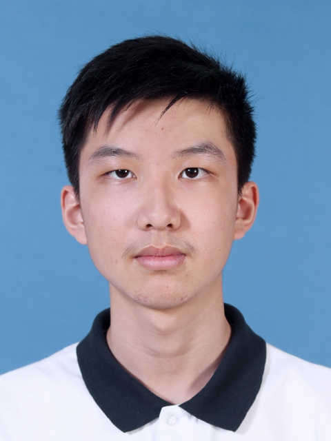

We are a team based in the [School of Computing, National University of Singapore](https://www.comp.nus.edu.sg).

You can reach us at the email `e1300530@u.nus.edu`

## Project team

### Huang Zekai

[[homepage](https://www.linkedin.com/in/zekai-huang-23213b28b)]
[[github](https://github.com/hzk-lab)]

* Role: Scheduling and tracking, including defining, assigning, and tracking project tasks.
* Responsibilities: Data Structure + Threading

### Benedict Bryan Tjandra

[[github](http://github.com/bryantjandra)]
[[portfolio](team/bryantjandra.md)]

* Role: Developer
* Responsibilities: UI + Code Quality

### Johnny Doe

[[github](http://github.com/johndoe)] [[portfolio](team/johndoe.md)]

* Role: Developer
* Responsibilities: Data

### Jean Doe

[[github](http://github.com/johndoe)]
[[portfolio](team/johndoe.md)]

* Role: Developer
* Responsibilities: Dev Ops + Threading

### Li Daoxin

[[github](https://github.com/Prog-Neuro-Com)]
[[portfolio](team/prog_neuro_com.md)]

* Role: Developer
* Responsibilities: Dev Ops + Threading
