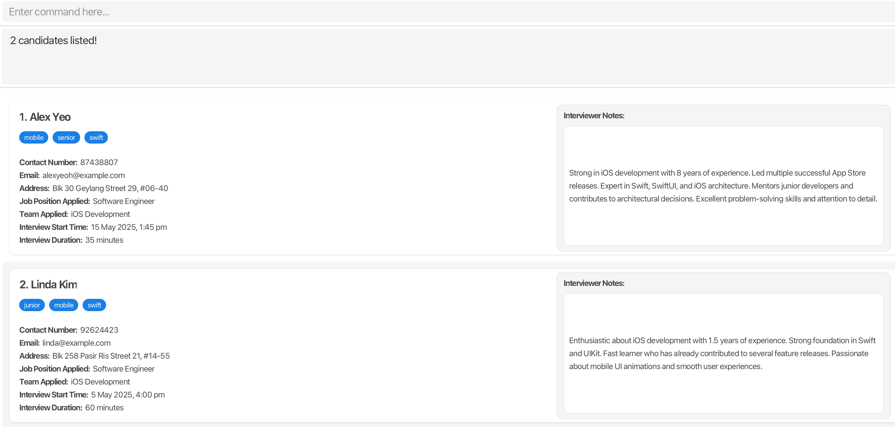
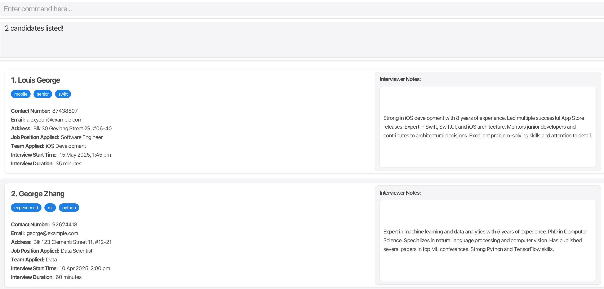

RecruitIntel is a **desktop application designed specifically for Apple's HR recruiters** to efficiently manage candidate information. While offering an easy-to-use visual interface, it features powerful text commands that help process candidate information considerably faster than traditional mouse-based applications.
### Who is RecruitIntel For?
**Primary Users:**
* HR recruiters at Apple, particularly those handling:
    * Hardware teams (chip design, hardware engineering)
    * Software teams (iOS, macOS, website development)
    * Operations teams (retail, security, facilities)

**Prerequisites:**
* Basic familiarity with command-line interfaces
* Experience with candidate management systems
* Access to a computer with Java 17 or above

### What RecruitIntel Does
**Core Features:**
* 🚀 Fast candidate information entry and search
* 🏷️ Classification system for candidate organization
* 📅 Interview scheduling and management
* 📝 Note-taking capability for interview feedback
* 💾 Automated saving of data after changes <br>

<br>
Navigate through sections using the table of contents below:

* Table of Contents
{:toc}

--------------------------------------------------------------------------------------------------------------------

## Quick start

1. Ensure you have Java `17` or above installed in your computer.<br>
   **Mac users:** Ensure you have the precise JDK version prescribed [here](https://se-education.org/guides/tutorials/javaInstallationMac.html).

2. Download the latest `recruitintel.jar` from our [releases page](https://github.com/AY2425S2-CS2103T-F14-3/tp/releases).

3. Create a dedicated folder for RecruitIntel:
    * Choose a location with at least 1GB of free space
    * Ensure you have write permissions for this location
    * Copy the downloaded JAR file into this folder

4. Launch RecruitIntel:
    * Open your terminal/command prompt
    * Navigate to the folder containing the JAR file: `cd path/to/folder`
    * Run the application: `java -jar recruitintel.jar`
    * A screen similar to the one below should appear within 5 seconds:

   


5. Type the command in the command box and press Enter to execute it. e.g. typing **`help`** and pressing Enter will open the help window.<br>
   Some example commands you can try:

    * `add n/John Doe p/98765432 e/johnd@example.com a/John street, block 123, #01-01 j/Software Engineer tm/IOS Development` : Adds a candidate named `John Doe` applying for a `Software Engineer` position  in the `IOS Development` team.

    * `note 1 Strong backend experience, but lacks iOS exposure.` : Adds a note to the 1st candidate in the list.

    * `interview 1 2025-04-01 10:00 40` : Schedules a 40-minute interview for the 1st candidate, scheduled at 10:00 AM on April 1, 2025.

    * `sort` : Sorts the candidates by ascending order of their scheduled interview time.

    * `undo` : Reverts the most recent change (e.g. adding, deleting, or editing a candidate).

    * `clear` : Deletes all candidates.


6. Refer to the [Features](#features) below for details of each command.

--------------------------------------------------------------------------------------------------------------------

## Features

<div markdown="block" class="alert alert-info">

**:information_source: Notes about the command format:**<br>

* Replace words in `UPPER_CASE` with the required information.
    * Example: in `add n/NAME`, replace `NAME` with the actual name like `add n/John Doe`

* Items in square brackets `[...]` are optional.
    * Example: `[t/TAG]` can be used as `t/Python` or omitted entirely

* Items with `…`​ can be used multiple times or omitted.
    * Example: `[t/TAG]…​` allows:
        * No tags: ` `
        * One tag: `t/Python`
        * Multiple tags: `t/Python t/Java t/AWS`

* You can enter the information in any order.<br>
  e.g. if the command specifies `n/NAME p/PHONE_NUMBER`, `p/PHONE_NUMBER n/NAME` is also acceptable.

* The `sort` command only sorts **currently displayed** candidates (i.e. those shown by the last command such as `classify`, `find`, etc.).

* When using `classify` to filter candidates, it will show only candidates that match all of your search criteria.
  Example: `classify t/python tm/Design` shows candidates who have both Python skills and applied for a position in the Design team.

* For simple commands like `help`, `list`, `exit`, and `clear`, any extra information you type will be ignored.
  Example: typing `help 123` works the same as typing just `help`.

* If you are using a PDF version of this document, be careful when copying and pasting commands that span multiple lines as space characters surrounding line-breaks may be omitted when copied over to the application.
</div>

### Viewing help : `help`

Shows a message explaining how to access the help page.

**Format**:
```
help
```

Expected output: <br>


### Adding a candidate: `add`

Adds a new candidate to RecruitIntel with their details and applied position.

**Format**:
```
add n/NAME p/PHONE_NUMBER e/EMAIL a/ADDRESS j/JOB_POSITION_APPLIED 
tm/TEAM_APPLIED [t/TAG]…​
```

**Key behaviors**:
* All details except tags are mandatory
* Email must be in a valid format
* Multiple tags can be added for better classification

**Examples**:
* Adding an iOS developer:
  ```
  add n/John Doe p/98765432 e/johnd@example.com a/123 Apple Park Way 
  j/Software Engineer tm/iOS Development t/Swift t/UIKit
  ```
* Adding a chip designer:
  ```
  add n/Jane Smith p/91234567 e/janes@example.com a/456 Infinite Loop 
  j/Hardware Engineer tm/Chip Design t/Verilog t/ASIC
  ```

💡 **Tips**:
* Use meaningful tags to track candidate skills and experiences
* Add multiple tags to make classification easier later on

⚠️ **Warning**:
* Avoid duplicate entries by checking for duplicates first

Expected output:
```
New candidate added: John Doe; Phone: 98765432; Email: johnd@example.com; 
Address: 123 Apple Park Way; Job Position: Software Engineer; 
Team: iOS Development; Tags: [UIKit][Swift]
```

### Listing all candidates : `list`

Shows a complete list of all candidates in RecruitIntel.

**Format**:
```
list
```

**Key behaviors**:
* Shows all candidates regardless of previous filters
* Displays candidates in order of when they were added

💡 **Tips**:
* Use this to reset view after filtering
* Combine with `sort` to organize the full list

Expected output:
```
Listed all candidates:
1. John Doe (iOS Development)
2. Jane Smith (Chip Design)
3. Alex Yeoh (Machine Learning)
...
```

### Editing a candidate : `edit`

Modifies existing candidate information in RecruitIntel.

**Format**:
```
edit INDEX [n/NAME] [p/PHONE] [e/EMAIL] [a/ADDRESS] [j/JOB_POSITION_APPLIED]
 [tm/TEAM_APPLIED] [t/TAG]…​
```

**Key behaviors**:
* `INDEX` must be a positive integer from the displayed list and not greater than the number of candidates in RecruitIntel
* At least one field must be provided for editing

**Examples**:
* Update contact information:
  ```
  edit 1 p/91234567 e/johndoe@example.com
  ```
* Update job position applied, team applied, and tags:
  ```
  edit 2 j/Machine Learning Engineer tm/AI Development t/Python t/TensorFlow
  ```

💡 **Tips**:
* Use `list` to see all candidates first
* An empty tag field (`t/`) removes all tags for that candidate

⚠️ **Warning**:
* Changes cannot be partially undone
* All existing tags are replaced when editing tags

Expected output:
```
Edited Candidate: Bryan Tjandra; Phone: 91234567; Email: johndoe@example.com; 
Address: Blk 30 Geylang Street 29, #06-40; Job Position: Software Engineer; 
Team: iOS Development; Tags: [senior][mobile][swift]
```

### Classifying candidates by attributes: `classify`

Groups and displays candidates based on their tags, teams, and/or job positions. This helps quickly find candidates matching a specific criteria.

**Format**:
```
classify [t/TAG] [tm/TEAM] [j/JOB_POSITION]
```

**Key behaviors**:
* Case-insensitive matching (e.g., `python` matches `Python`)
* Partial matching supported (e.g., `eng` matches `Engineer`)
* Shows candidates that match **all** provided criteria

**Examples**:
* Find all candidates with Python expertise:
  ```
  classify t/python
  ```
* Find candidates with a figma tag, applying for Frontend Engineer positions at the Web Development team:
  ```
  classify t/figma j/Software Engineer tm/Web Development
  ```

💡 **Tips**:
* Start with broader searches and refine as needed
* Use partial matches for flexibility
* Combine with `sort` command to organize results by interview time

⚠️ **Warning**: Empty results might mean your criteria are too restrictive

Expected output:


### Finding candidates by name: `find`

Searches for candidates whose names contain any of the given keywords.

**Format**:
```
find KEYWORD [MORE_KEYWORDS]
```

**Key behaviors**:
* Case-insensitive search (e.g., `hans` matches `Hans`)
* Order of keywords doesn't matter, e.g. `Hans Bo` will match `Bo Hans`
* Partial word matching supported, e.g. `Han` will match `Hans`
* Candidates matching at least one keyword will be returned e.g. `Hans Bo` will return `Hans Gruber`, `Bo Yang`

**Examples**:
* Search by single name:
  ```
  find John
  ```
  
💡 **Tips**:
* Use shorter keywords for broader searches
* Try different name variations

Expected output:


### Adding notes to a candidate: `note`

Adds or updates interviewer notes for a candidate.

**Format**:
```
note INDEX NOTE_TEXT
```

**Key behaviors**:
* `INDEX` must be a positive integer from the displayed list and not greater than the number of candidates in RecruitIntel
* Note text has a maximum of 450 characters
* New note overwrites any existing note for that candidate

**Examples**:
* Add interview observations:
  ```
  note 3 Great system design skills, good cultural fit.
  Team lead interview recommended.
  ```

💡 **Tips**:
* Be specific and objective in notes
* Include key technical observations

⚠️ **Warning**:
* Cannot recover overwritten notes
* Stay within character limit

Expected output:
```
Note added to candidate #3: "Great system design skills, good cultural fit. 
Team lead interview recommended."
```

### Deleting a candidate : `delete`

Removes a candidate from RecruitIntel permanently.

**Format**:
```
delete INDEX
```

**Key behaviors**:
* Deletion is permanent (but can be undone)

**Examples**:
* Delete after listing:
  ```
  list
  delete 2
  ```

💡 **Tips**:
* Use `undo` if needed
* Check index in current view

⚠️ **Warning**:
* Action cannot be reversed after closing app
* Verify index in filtered lists

Expected output:
```
Deleted Candidate: John Doe; Phone: 98765432; Email: johnd@example.com; 
Address: 123 Apple Park Way; Job Position: Software Engineer; 
Team: iOS Development; Tags: [UIKit][Swift]
```

### Scheduling an interview: `interview`

Sets or updates interview timing for a candidate.

**Format**:
```
interview INDEX START_TIME DURATION
```

**Key behaviors**:
* START_TIME format: yyyy-MM-dd HH:mm
* DURATION must be a multiple of 5 
* Uses the 24-hour time format

**Examples**:
* Schedule a morning interview for 40 minutes:
  ```
  interview 1 2025-04-01 10:00 40
  ```

💡 **Tips**:
* Leave buffer time between interviews
* Use `sort` to see the schedule
* Consider time zones for remote interviews
* Standard durations:
    - 30 mins: Initial screening
    - 45 mins: Technical assessment
    - 60 mins: Team interviews

⚠️ **Warning**:
* Verify date format carefully
* Check for scheduling conflicts

Expected output:
```
Interview set for candidate #1: Start = 2025-04-01 10:00, Duration = 40 minutes
```

### Sorting candidates by interview time: `sort`

Sorts the currently displayed candidates by their scheduled interview start times in ascending order.

**Format**:
```
sort
```

**Key behaviors**:
* Only sorts the **current list** of displayed candidates
* Candidates with interviews are sorted by start time (ascending)
* Candidates without interviews appear at the end

**Examples**:
* View interviews for the iOS Development team in order:
  ```
  classify tm/iOS Development
  sort
  ```

💡 **Tips**:
* Use after `classify` to organize filtered candidates
* Combine with `interview` command for scheduling

Expected output:
```
Sorted all displayed candidates by interview time.
1. John Doe (Interview Start Time: 1 May 2025, 12:00 pm)
2. Alice Tan (Interview Start Time: 3 May 2025, 2:30 pm)
3. Bob Chen (Interview Start Time: 6 May 2025, 10:00 am)
```

### Undoing changes: `undo`

Reverts RecruitIntel to its state before the last modifying command.

**Format**:
```
undo
```

**Key behaviors**:
* Restores the previous state
* Works with modifying commands (`add`, `delete`, `edit`, etc.)
* Multiple `undo` commands will revert multiple changes

**Examples**:
* Undo an accidental deletion:
  ```
  delete 3    // Oops, wrong candidate!
  undo        // Candidate is restored
  ```

💡 **Tips**:
* Use immediately after realizing a mistake

⚠️ **Warning**:
* Cannot undo after closing the application
* Some commands cannot be undone (e.g., `clear`)

### Redoing changes: `redo`

Restores a previously undone command in RecruitIntel.

**Format**:
```
redo
```

**Key behaviors**:
* Restores the most recently undone change
* Only works after an `undo` command
* Multiple `redo` commands will restore multiple changes in sequence

**Examples**:
* Redo an undone deletion:
  ```
  delete 3           // Delete candidate
  undo              // Oops, needed that deletion
  redo              // Deletion restored
  ```

💡 **Tips**:
* Use to restore changes if you undo too many times
* Check the candidate list after redoing to verify changes

⚠️ **Warning**:
* Cannot redo after closing the application
* Some commands cannot be redone (e.g., `clear`)


### Clearing all data : `clear`

Removes all candidate data from RecruitIntel.

**Format**:
```
clear
```

### Exiting the program : `exit`

Closes RecruitIntel and saves all data.

**Format**:
```
exit
```

### Data Management

RecruitIntel handles your data with care and provides features to manage data:

#### Automatic Saving
* All changes are saved immediately
* No manual save required
* Data does not disappear after exiting the application

#### Data File
* Location: `[JAR file location]/data/recruitintel.json`
* Format: JSON (human-readable)
* Can be manually edited (advanced users)

<div markdown="span" class="alert alert-warning">:exclamation: **Caution:**
If your changes to the data file makes its format invalid, RecruitIntel will discard all data and start with an empty data file at the next run. Hence, it is recommended to take a backup of the file before editing it.<br>
Furthermore, certain edits can cause RecruitIntel to behave in unexpected ways (e.g., if a value entered is outside of the acceptable range). Therefore, edit the data file only if you are confident that you can update it correctly.
</div>


--------------------------------------------------------------------------------------------------------------------

## FAQ

**Q**: How do I transfer my candidate data to another computer?
**A**: Follow these steps:
1. Install RecruitIntel on the new computer
2. Locate the data file (`recruitintel.json`) on your old computer
3. Copy this file to the same location on the new computer
4. Start RecruitIntel on the new computer

**Q**: What should I do if the application won't start?
**A**: Try these solutions:
1. Verify Java 17 is installed correctly
2. Check the data file for corruption
3. Delete `preferences.json` if it exists
4. Contact support if issues persist

**Q**: Why does my `classify` command return no results?
**A**: This could happen for several reasons:
1. Your search criteria might be too specific - try removing some filters
2. The tags or team names might be misspelled - check for typos
3. The candidates might not have all the specified attributes - try searching with fewer criteria

**Q**: Why can't I schedule an interview for a specific time?
**A**: Check these potential issues:
1. Ensure the date format is correct (YYYY-MM-DD)
2. Verify the time is in 24-hour format
3. Make sure the duration is a multiple of 5 minutes

## Known Issues

1. **Multiple Screen Display Issue**
    * **Problem**: Screen may open off-screen when switching from multiple to single screen
    * **Solution**: Delete `preferences.json` and run the application again
    * **Prevention**: Close application before changing display setup

2. **Help Window Behavior**
    * **Problem**: Minimized Help Window doesn't respond to help command. The Help Window remains minimized
    * **Solution**: Manually restore the minimized Help Window
    * **Workaround**: Close and reopen application

3. **Complex Command Formatting**
    * **Problem**: Commands with multiple tags or long addresses might be difficult to format correctly
    * **Solution**: Break down complex commands into smaller steps
    * **Example**: Instead of adding all tags at once, use `edit` to add tags gradually
    * **Prevention**: Use the `help` command to verify command format before execution

4. **Data File Corruption**
    * **Problem**: Application fails to start or behaves unexpectedly after manual data file edits
    * **Solution**: Restore from backup or start with a fresh data file
    * **Prevention**: Always create backups before manual edits
    * **Workaround**: Use the application's commands instead of manual file edits


## Glossary

The following terms are used throughout this guide:

* **Index**: A numerical identifier assigned to each candidate in the displayed list. When executing commands that require candidate selection (e.g., `delete 1`), use the number corresponding to the candidate's position in the current view. `delete 1` will delete the 1st candidate shown in the displayed list.

* **Command**: A specific instruction entered into RecruitIntel to perform an action. Commands follow a structured format and are executed by pressing Enter. For example, the `add` command initiates the process of creating a new candidate record.

* **Tag**: A label used to categorize and organize candidates based on specific attributes. Tags can represent skills, qualifications, or other relevant characteristics. For instance, `t/Swift` indicates proficiency in the Swift programming language.

* **Command Format**: The specific structure required for entering commands, including prefixes (e.g., `n/` for name) and separators. This format ensures accurate interpretation of user input.

* **JSON file**: A type of computer file that stores candidate information.

* **Terminal/Command Prompt**: A program where you type commands to run RecruitIntel. It is a text-based way to start and control the application.

## Command Summary

Action | Format, Examples
--------|------------------
**Add** | `add n/NAME p/PHONE_NUMBER e/EMAIL a/ADDRESS j/JOB_POSITION_APPLIED tm/TEAM_APPLIED [t/TAG]…​` <br> e.g., `add n/James Ho p/22224444 e/jamesho@example.com a/123, Clementi Rd, 1234665 j/Staff Engineer tm/AI & Machine Learning t/Python t/AI`
**Classify** | `classify [t/TAG] [tm/TEAM] [j/JOB_POSITION]`<br> e.g., `classify t/python tm/Design j/Software Engineer`
**Clear** | `clear`
**Delete** | `delete INDEX`<br> e.g., `delete 3`
**Edit** | `edit INDEX [n/NAME] [p/PHONE_NUMBER] [e/EMAIL] [a/ADDRESS] [j/JOB_POSITION_APPLIED] [tm/TEAM_APPLIED] [t/TAG]…​`<br> e.g.,`edit 2 n/James Lee e/jameslee@example.com j/Data Scientist`
**Exit** | `exit`
**Find** | `find KEYWORD [MORE_KEYWORDS]`<br> e.g., `find James Jake`
**Help** | `help`
**List** | `list`
**Interview** | `interview INDEX START_TIME DURATION`<br> e.g., `interview 1 2025-04-01 10:00 40`
**Note** | `note INDEX NOTE_TEXT`<br> e.g., `note 1 The interviewee really exceeded our expectations!`
**Sort** | `sort`
**Undo** | `undo`
**Redo** | `redo`

