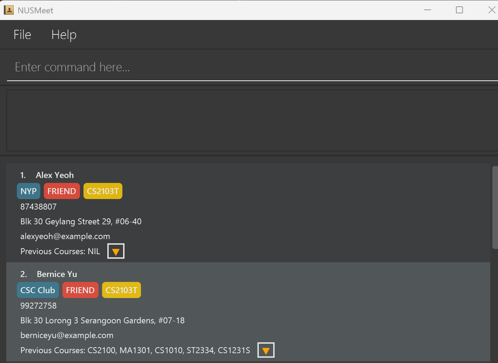

RecruitIntel is a **desktop app for managing candidate information, optimized for use via a Command Line Interface** (CLI) while still providing the benefits of a Graphical User Interface (GUI). Designed for HR recruiters at Apple, RecruitIntel enables faster candidate tracking and organization compared to traditional GUI-based tools.

* Table of Contents
{:toc}

--------------------------------------------------------------------------------------------------------------------

## Quick start

1. Ensure you have Java `17` or above installed in your Computer. 
   **Mac users:** Ensure you have the precise JDK version prescribed [here](https://se-education.org/guides/tutorials/javaInstallationMac.html).

1. Download the latest `.jar` file from [here](https://github.com/se-edu/addressbook-level3/releases).

1. Copy the file to the folder you want to use as the _home folder_ for RecruitIntel.

1. Open a command terminal, `cd` into the folder you put the jar file in, and use the `java -jar recruitintel.jar` command to run the application. 
   A GUI similar to the below should appear in a few seconds. Note how the app contains some sample data. 
   

1. Type the command in the command box and press Enter to execute it. e.g. typing **`help`** and pressing Enter will open the help window. 
   Some example commands you can try:

   * `list` : Lists all candidates.

   * `add n/John Doe p/98765432 e/johnd@example.com a/John street, block 123, #01-01 j/Software Engineer tm/IOS Development` : Adds a candidate named `John Doe` applying for `Software Engineer`  in the `IOS Development` team. 

   * `delete 3` : Deletes the 3rd candidate in the current list.

   * `find John` : Finds candidates whose names contain the word `John`.

   * `classify t/python tm/Design j/Software Engineer` : Lists candidates with tag `python`, in the `Design` team, or applying for `Software Engineer`.

   * `note 1 Strong backend experience, but lacks iOS exposure.` : Adds a note to the 1st candidate in the list.

   * `interview 1 2025-04-01 10:00 40` : Schedules a 40-minute interview for the 1st candidate starting at 10:00 AM on April 1, 2025.

   * `sort` : Sorts the listed candidates by their scheduled interview time.

   * `undo` : Reverts the most recent change and restores the previous state.

   * `clear` : Deletes all candidates.

   * `exit` : Exits the app.

1. Refer to the [Features](#features) below for details of each command.

--------------------------------------------------------------------------------------------------------------------

## Features

**:information_source: Notes about the command format:** 

* Words in `UPPER_CASE` are the parameters to be supplied by the user. 
  e.g. in `add n/NAME`, `NAME` is a parameter which can be used as `add n/John Doe`.

* Items in square brackets are optional. 
  e.g `n/NAME [t/TAG]` can be used as `n/John Doe t/Engineer` or as `n/John Doe`.

* Items with `…`​ after them can be used multiple times including zero times. 
  e.g. `[t/TAG]…​` can be used as ` ` (i.e. 0 times), `t/software`, `t/software t/hardware` etc.

* Parameters can be in any order. 
  e.g. if the command specifies `n/NAME p/PHONE_NUMBER`, `p/PHONE_NUMBER n/NAME` is also acceptable.

* The `sort` command only sorts **currently displayed** candidates (i.e. those shown by the last command such as `classify`, `find`, etc.), not all candidates in RecruitIntel.

* The `classify` command performs an **AND search** — only candidates matching **all** provided attributes (tag, team, job position) will be returned.
    e.g. `classify t/python tm/Design` returns candidates who have the tag `python` **and** are in the `Design` team.

* Extraneous parameters for commands that do not take in parameters (such as `help`, `list`, `exit` and `clear`) will be ignored. 
  e.g. if the command specifies `help 123`, it will be interpreted as `help`.

* If you are using a PDF version of this document, be careful when copying and pasting commands that span multiple lines as space characters surrounding line-breaks may be omitted when copied over to the application.

### Viewing help : `help`

Shows a message explaning how to access the help page.

Format: `help`

### Adding a candidate: `add`

Adds a candidate to RecruitIntel.

Format: `add n/NAME p/PHONE_NUMBER e/EMAIL a/ADDRESS j/JOB_POSITION_APPLIED tm/TEAM_APPLIED [t/TAG]…​`

:bulb: **Tip:**
A candidate can have any number of tags (including 0)

Examples:
* `add n/John Doe p/98765432 e/johnd@example.com a/John street, block 123, #01-01 j/Software Engineer tm/IOS Development`
* `add n/Betsy Crowe t/cpp e/betsycrowe@example.com a/Newgate Prison p/1234567 j/ASIC Design Engineer tm/Hardware `

### Listing all candidates : `list`

Shows a list of all candidates in RecruitIntel.

Format: `list`

### Editing a candidate : `edit`

Edits an existing candidate in RecruitIntel.

Format: `edit INDEX [n/NAME] [p/PHONE] [e/EMAIL] [a/ADDRESS] [j/JOB_POSITION_APPLIED] [tm/TEAM_APPLIED] [t/TAG]…​`

* Edits the candidate at the specified `INDEX`. The index refers to the index number shown in the displayed candidate list. The index **must be a positive integer** 1, 2, 3, …​
* At least one of the optional fields must be provided.
* Existing values will be updated to the input values.
* When editing tags, the existing tags of the candidate will be removed i.e adding of tags is not cumulative.
* You can remove all the candidate’s tags by typing `t/` without
    specifying any tags after it.

Examples:
* `edit 1 p/91234567 e/johndoe@example.com` – Updates phone and email for the 1st candidate.
* `edit 2 n/Alice Tan j/Machine Learning Engineer` – Updates name and job position for the 2nd candidate.

### Classifying candidates by attributes: `classify`

Classifies candidates who match any of the given attributes (tag, team, or job position).

Format: `classify [t/TAG] [tm/TEAM] [j/JOB_POSITION]`

* The search is case-insensitive. e.g. `python` will match `Python`
* The order of the attributes does not matter. e.g. `t/python tm/Design` is equivalent to `tm/Design t/python`
* Partial matches are supported. e.g. `engi` can be matched to `Engineer`
* Candidates matching **all** provided attributes will be returned (i.e. `AND` search).
  e.g. `t/python tm/Design` will return candidates who both have the tag `python` **and** are in the `Design` team.

Examples:
* `classify t/python` returns candidates with the tag `Python`
* `classify tm/Design j/Software Engineer` returns candidates in the `Design` team and with the job position `Software Engineer`
* `classify t/python tm/Design j/Software Engineer` returns candidates matching all three attributes

### Locating candidates by name: `find`

Finds candidates whose names contain any of the given keywords.

Format: `find KEYWORD [MORE_KEYWORDS]`

* The search is case-insensitive. e.g `hans` will match `Hans`
* The order of the keywords does not matter. e.g. `Hans Bo` will match `Bo Hans`
* Only the name is searched.
* Partial words can also be matched e.g. `Han` will match `Hans`
* Candidates matching at least one keyword will be returned (i.e. `OR` search).
  e.g. `Hans Bo` will return `Hans Gruber`, `Bo Yang`

Examples:
* `find John` returns `john` and `John Doe`
* `find alex david` returns `Alex Yeoh`, `David Li` 
  

### Adding notes to a candidate: `note`

Adds interviewer notes to the candidate identified by the index number in the currently displayed candidate list.

Format: `note INDEX [NOTE_FOR_THE_INTERVIEWEE]`

* The specified `INDEX` must be a positive integer and must refer to a valid candidate in the displayed list.
* The note text can be up to 450 characters.
* Adding a note will overwrite any existing note for that candidate.

Examples:
* `note 1 The interviewee really exceeded our expectations!` adds a note to the first candidate in the list
* `note 3 Strong backend experience, but lacks iOS exposure.` adds a note to the third candidate

### Deleting a candidate : `delete`

Deletes the specified candidate from RecruitIntel

Format: `delete INDEX`

* Deletes the candidate at the specified `INDEX`.
* The index refers to the index number shown in the displayed candidate list.
* The index **must be a positive integer** 1, 2, 3, …​

Examples:
* `list` followed by `delete 2` deletes the 2nd candidate in RecruitIntel.
* `find Betsy` followed by `delete 1` deletes the 1st candidate in the results of the `find` command.

### Scheduling an interview: `interview`

Sets the interview time for the candidate identified by the index number in the currently displayed candidate list.

Format: `interview INDEX [START_TIME] [DURATION]`

* `INDEX` must be a positive integer and refer to a valid candidate in the displayed list.
* `START_TIME` must follow the format `yyyy-MM-dd HH:mm`, using 24-hour time.
* `DURATION` must be a positive integer that is a multiple of 5 (e.g. 5, 10, 15...).

Examples:
* `interview 1 2025-04-01 10:00 40` schedules a 40-minute interview starting at 10:00 AM on April 1, 2025 for the first candidate
* `interview 2 2025-04-03 14:30 30` schedules a 30-minute interview for the second candidate on April 3, 2025 at 2:30 PM

### Sorting candidates by interview time: `sort`

Sorts the currently displayed candidates by their scheduled interview start times in ascending order.

Format: `sort`

* Only candidates in the **current list** are sorted.  
  For example, if the last command was `classify`, only the classified candidates will be sorted.
* Candidates **without a scheduled interview** will appear **after** those with a scheduled time.
* This command helps recruiters quickly view the upcoming interview order based on time.

Examples:
* After running `classify t/python`, running `sort` will sort the Python-tagged candidates by interview time.
* After running `find John`, running `sort` will sort all candidates named John by their interview time.

### Undoing the last command: `undo`

Reverts the address book to the state before the most recent command was executed.

Format: `undo`

* Restores the model to its **previous state**, effectively undoing the last modifying command.
* Can be used to undo commands such as `add`, `delete`, `edit`, `note`, `interview`, `classify`, etc.
* Does **not** undo non-modifying commands like `find`, `list`, or `sort`.

Examples:
* After mistakenly deleting a candidate with `delete 3`, running `undo` will bring the candidate back.
* After setting an incorrect interview time with `interview 2 2025-04-01 12:00 30`, running `undo` will revert it.

### Clearing all entries : `clear`

Clears all entries from RecruitIntel.

Format: `clear`

### Exiting the program : `exit`

Exits the program.

Format: `exit`

### Saving the data

Candidate data is automatically saved after any command that modifies data. No manual saving is required.

### Editing the data file

RecruitIntel data are saved automatically as a JSON file `[JAR file location]/data/recruitintel.json`. Advanced users are welcome to update data directly by editing that data file.

:exclamation: **Caution:**
If your changes to the data file makes its format invalid, RecruitIntel will discard all data and start with an empty data file at the next run. Hence, it is recommended to take a backup of the file before editing it. 
Furthermore, certain edits can cause RecruitIntel to behave in unexpected ways (e.g., if a value entered is outside of the acceptable range). Therefore, edit the data file only if you are confident that you can update it correctly.

### Archiving data files `[coming in v2.0]`

_Details coming soon ..._

--------------------------------------------------------------------------------------------------------------------

## FAQ

**Q**: How do I transfer my candidate data to another computer? 
**A**: Install the app in the other computer and overwrite the empty data file it creates with the file that contains the data of your previous RecruitIntel home folder.

--------------------------------------------------------------------------------------------------------------------

## Known issues

1. **When using multiple screens**, if you move the application to a secondary screen, and later switch to using only the primary screen, the GUI will open off-screen. The remedy is to delete the `preferences.json` file created by the application before running the application again.
2. **If you minimize the Help Window** and then run the `help` command (or use the `Help` menu, or the keyboard shortcut `F1`) again, the original Help Window will remain minimized, and no new Help Window will appear. The remedy is to manually restore the minimized Help Window.

--------------------------------------------------------------------------------------------------------------------

## Command summary

Action | Format, Examples
--------|------------------
**Add** | `add n/NAME p/PHONE_NUMBER e/EMAIL a/ADDRESS j/JOB_POSITION_APPLIED tm/TEAM_APPLIED [t/TAG]…​`   e.g., `add n/James Ho p/22224444 e/jamesho@example.com a/123, Clementi Rd, 1234665 j/Staff Engineer tm/AI & Machine Learning t/Python t/AI`
**Classify** | `classify [t/TAG] [tm/TEAM] [j/JOB_POSITION]`  e.g., `classify t/python tm/Design j/Software Engineer`
**Clear** | `clear`
**Delete** | `delete INDEX`  e.g., `delete 3`
**Edit** | `edit INDEX [n/NAME] [p/PHONE_NUMBER] [e/EMAIL] [a/ADDRESS] j/JOB_POSITION_APPLIED tm/TEAM_APPLIED [t/TAG]…​`  e.g.,`edit 2 n/James Lee e/jameslee@example.com j/Data Scientist`
**Exit** | `exit`
**Find** | `find KEYWORD [MORE_KEYWORDS]`  e.g., `find James Jake`
**Help** | `help`
**List** | `list`
**Interview** | `interview INDEX [STARTTIME] [DURATION]`  e.g., `interview 1 2025-04-01 10:00 40`
**Note** | `note INDEX [NOTE_FOR_THE_INTERVIEWEE]`  e.g., `note 1 The interviewee really exceeded our expectations!`
**Sort** | `sort`
**Undo** | `undo`
